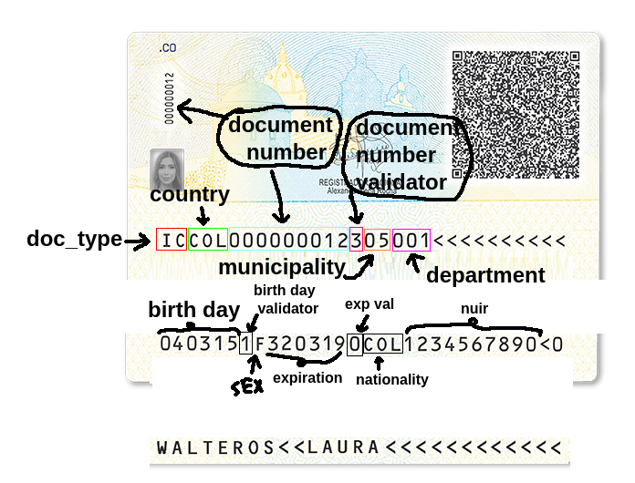
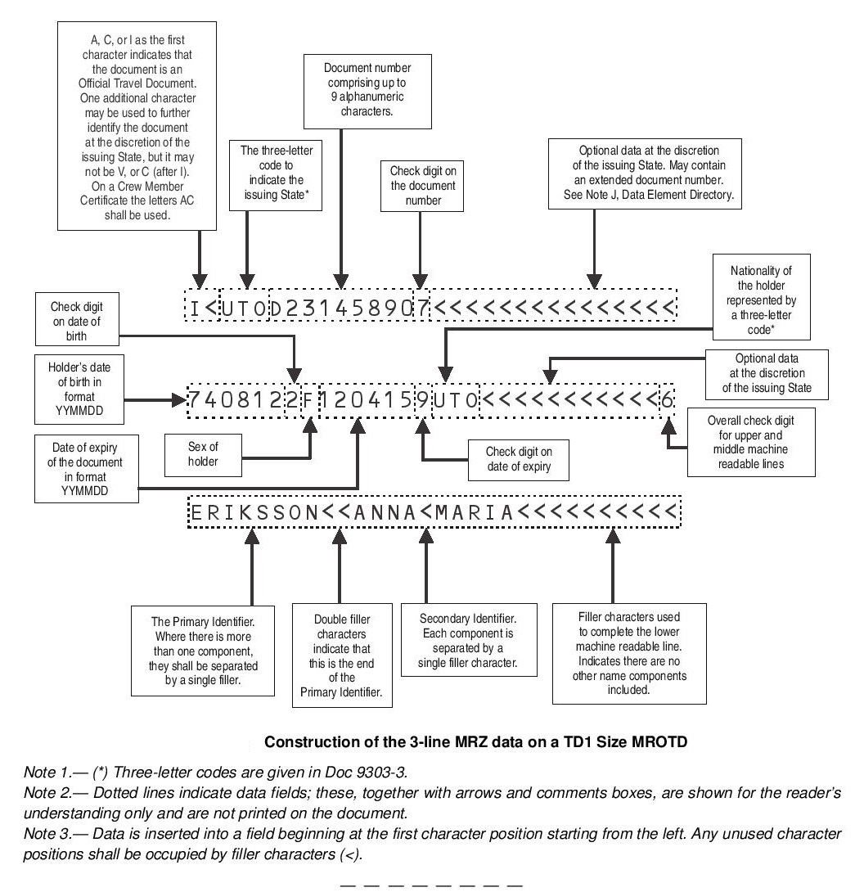

Permite parsear el código MRZ que está en el reverso de la cédula colombiana

En la siguiente imagen se puede observar el código MRZ en el reverso de la cédula colombiana:



Es un MRZ con formato TD1 

- https://en.wikipedia.org/wiki/Machine-readable_passport



### Instalación

```bash
pip install -r requirements.txt
```

### Ejecución usando la librería

Puede ver el fichero test/test_analyzer.py para ver un ejemplo de uso


```python
import os
import boto3

img_file_name = "data/fake_1.png"
bucket_name = "testdocid"
region_name = os.environ.get('AWS_REGION', 'us-east-1')
session = boto3.Session()

_textract_client = session.client('textract', region_name=region_name)
textract_client = Boto3TextractClient(_textract_client)

_s3_client = session.client('s3')
s3_client = Boto3S3Client(_s3_client)

a = TextractColCedulaMRZAnalyzer(
    textract_client, s3_client, bucket_name, ColombianMRZParser()
)

with open(img_file_name, 'rb') as f:
    img_file_bytes = f.read()

a.analyze_document_id(img_file_bytes)
```

El resultado es un objeto como el siguiente:

```j́son
{
    "filename": "fake_1.png",
    "result": {
        "fields": {
            "bird_date": "2004-03-15",
            "sex": "F",
            "expiration_date": "2032-03-19",
            "nationality_country_code": "COL",
            "nationality_country_name": "COLOMBIA",
            "nuip": "1234567890",
            "first_names": "LAURA",
            "last_names": "WALTEROS",
            "is_truncated": false,
            "doc_type": "I",
            "country_code": "COL",
            "country_name": "Colombia",
            "doc_number": "12",
            "doc_number_check_digit": "3",
            "mun_code": "05",
            "mun_name": "BOLIVAR",
            "dep_code": "001",
            "dep_name": "CARTAGENA",
            "errors": []
        },
        "metadata": {
            "lines": [
                "ICCOL000000012305001<<<<<<<<<<",
                "0403151F3203190C0L1234567890<0",
                "WALTEROS<<LAURA<<<<<<<<<<<<"
            ],
            "confidence": 100.0
        }
    }
}
```

### Ejecución usando el API

Este repositorio tambien tiene un API lista para usar

Basta con correr el siguiente comando para que el API levante en el puerto 8000:

```bash
uvicorn server:app --reload
```

Luego puede hacer una petición POST al endpoint /analyze:

```bash
curl --location 'http://localhost:8000/analyze' \
--form 'file=@"/home/usuario/Projects/mrz/test/data/fake_1.png"'
```

### Requerimientos

- Python 3.6 o superior
- Una cuenta de AWS con acceso a S3 y Textract

### Variables de entorno

```bash
AWS_ACCESS_KEY_ID=AKIA...
AWS_BUCKET_NAME=testbucket
AWS_REGION_NAME=us-east-1
AWS_SECRET_ACCESS_KEY=9Nuld...
PYTHONUNBUFFERED=1
```


